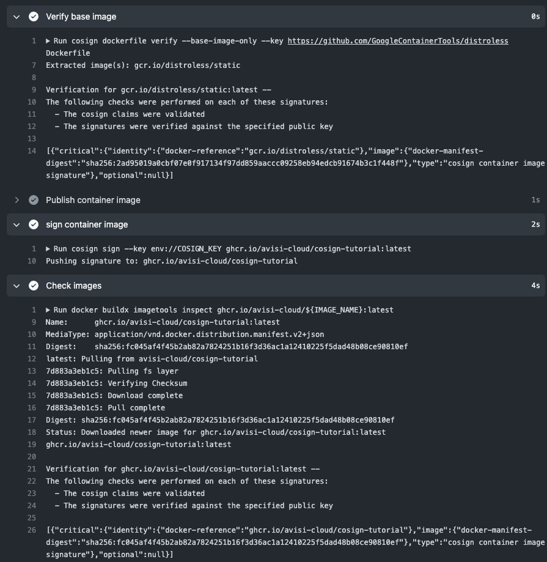

# Cosign tutorial - signing OCI artifacts

Cosign allows us to sign our container images and verify the integrity when pulling images from our registry. This repository is a tutorial on how to use cosign to sign your OCI artifacts.

Cosign is a project part of [sigstore](https://www.sigstore.dev/), an effort to introduce a new standard for signing, verifying and protecting software.

# Tutorial

## Generate a key pair

Generate a key pair that will be used to sign your OCI artifacts / container images.

```shell
❯ cosign generate-key-pair
Enter password for private key:
Enter again:
Private key written to cosign.key
Public key written to cosign.pub
```

Make sure you save your password, as you will need it to sign OCI artifacts.

## Cosign CLI

### Sign OCI artifacts

Now you have everything needed from cosign to sign an OCI artifact.
For this step, you will need write access to a registry, as well as a container image.

Demo image:
```shell
❯ docker pull docker.io/library/nginx:latest
❯ docker tag docker.io/library/nginx:latest ghcr.io/avisi-cloud/cosign-tutorial-nginx:latest
```

Sign the artifact:

```shell
❯ cosign sign --key cosign.key ghcr.io/avisi-cloud/cosign-tutorial-nginx:latest
```

Note that the image should already be present in the registry, otherwise you will receive an error:

```shell
Error: signing [ghcr.io/avisi-cloud/cosign-tutorial-nginx:latest]: accessing entity: entity not found in registry
main.go:46: error during command execution: signing [ghcr.io/avisi-cloud/cosign-tutorial-nginx:latest]: accessing entity: entity not found in registry
```

When signing the image:
```shell
❯ cosign sign --key cosign.key ghcr.io/avisi-cloud/cosign-tutorial-nginx:latest
Enter password for private key: 
Pushing signature to: ghcr.io/avisi-cloud/cosign-tutorial-nginx
```

### Verify our signature

You can verify in Github Packages that this image has been signed:


Note that this image contains two tags: `latest` and the `sha256-` tag. 

`sha256-3536d368b898eef291fb1f6d184a95f8bc1a6f863c48457395aab859fda354d1.sig` is the signature created and pushed by cosign. It is used by cosign to verify this image against the public key.

You can verify this through the CLI using `cosign verify`:

```shell
❯ cosign verify --key cosign.pub ghcr.io/avisi-cloud/cosign-tutorial-nginx:latest

Verification for ghcr.io/avisi-cloud/cosign-tutorial-nginx:latest --
The following checks were performed on each of these signatures:
  - The cosign claims were validated
  - The signatures were verified against the specified public key

[{"critical":{"identity":{"docker-reference":"ghcr.io/avisi-cloud/cosign-tutorial-nginx"},"image":{"docker-manifest-digest":"sha256:3536d368b898eef291fb1f6d184a95f8bc1a6f863c48457395aab859fda354d1"},"type":"cosign container image signature"},"optional":null}]
```

## Using Github Actions

You can automate the signing of your container images by using Github Actions. For this you need to do the following:

First add the `cosign.key` and `password` as a secret to your project or Github organisation as an [action secret](https://docs.github.com/en/actions/security-guides/encrypted-secrets).
You can do this within your project or by using organisation secrets.


### Set-up action


You can set-up cosign by using the following job step:

```yaml
jobs:
  build-push:
    runs-on: ubuntu-latest
    steps:
      - name: Checkout
        uses: actions/checkout@v3
      # install cosign
      - name: Set up cosign
        uses: sigstore/cosign-installer@main

      # log in to the ghcr registry
      - name: Login to GitHub Container Registry
        uses: docker/login-action@v2
        with:
          registry: ghcr.io
          username: ${{ github.actor }}
          password: ${{ secrets.GITHUB_TOKEN }}
```

You can also verify the base image in your `Dockerfile`. This allows you to make sure the base image used is from a trusted source.

```yaml
      - name: Verify base image
        run: |          
          cosign dockerfile verify --base-image-only --key https://github.com/GoogleContainerTools/distroless Dockerfile
```

Next build and publish your container image to the registry:
```yaml
      - name: Publish container image
        uses: docker/build-push-action@v3
        with:
          push: true
          builder: ${{ steps.buildx.outputs.name }}
          context: .
          file: ./Dockerfile
          platforms: linux/amd64
          tags: |
            ghcr.io/avisi-cloud/${{ env.IMAGE_NAME }}:${{ env.VERSION }}
          labels: |
            org.opencontainers.image.title=${{ github.event.repository.name }}
            org.opencontainers.image.description=${{ github.event.repository.description }}
            org.opencontainers.image.url=${{ github.event.repository.html_url }}
            org.opencontainers.image.revision=${{ github.sha }}
            org.opencontainers.image.version=${{ env.VERSION }}
```

> Note that this entire process will work with any container registry, not just ghcr.

Now we can sign the images we just published to our registry by using `cosign sign` with the `cosign.key` and password we used as our orgnaisation or project secret:

```yaml
      - name: sign container image
        run: |
            cosign sign --key env://COSIGN_KEY ghcr.io/avisi-cloud/${{ env.IMAGE_NAME }}:${{ env.VERSION }}
        shell: bash
        env:
          COSIGN_KEY: ${{secrets.COSIGN_KEY}}
          COSIGN_PASSWORD: ${{secrets.COSIGN_PASSWORD}}
```

And a final step we can verify our entire signing proces worked as expected by running `cosign verify` as our last step in the action workflow:

```yaml

      - name: Check images
        run: |
          docker buildx imagetools inspect ghcr.io/avisi-cloud/${IMAGE_NAME}:${{ env.VERSION }}
          docker pull ghcr.io/avisi-cloud/${IMAGE_NAME}:${{ env.VERSION }}
          cosign verify --key cosign.pub ghcr.io/avisi-cloud/${IMAGE_NAME}:${{ env.VERSION }} 
```

You can see a full example [here](https://github.com/avisi-cloud/cosign-tutorial/blob/main/.github/workflows/release.yml).



## Gitlab CI Pipelines

This is also possible in Gitlab CI or any other CI service. Here is an example for in Gitlab:
